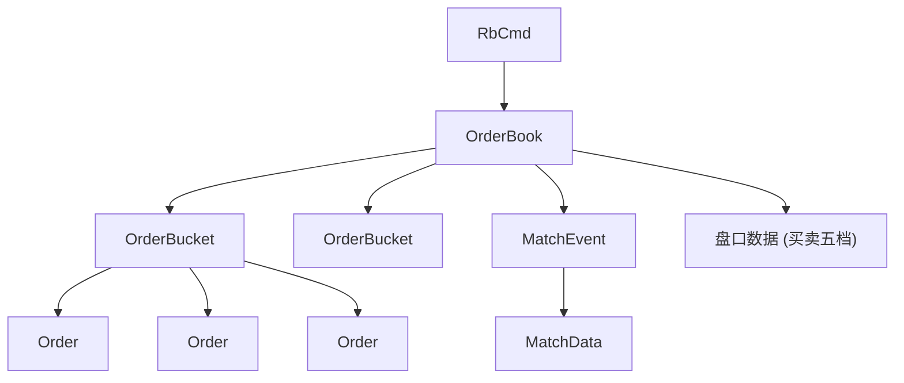

卖五 46.93 5
卖四 46.92 10
卖三 46.91 296
卖二 46.90 35
卖一 46.88 601
------------------------------
买一 46.87 30
买二 46.86 51
买三 46.85 10
买四 46.83 16
买五 46.82 52

上面的每一行就是一个orderBucket，这里有10个orderBucket

order本质就是一笔笔的委托
一个orderBucket有多个order
一个orderBook有多个orderBucket

eg: 卖四 46.92 10
这说明了 这个orderBucket的价格是46.92 有10手买单 ，这个10是根据order算出来的

当一个新的委托order(RbCmd)进来的时候，orderBook会根据这个委托的价格和量去orderBucket中对应的委托

eg:有一个47.00 100股的买单委托，那么orderBook 从卖一 到 卖五依次寻找 找到与之匹配的单子
找到了就会往外面丢MatchEvent ，MatchEvent会被对应的个handler变成MatchData 然后发布到总线
