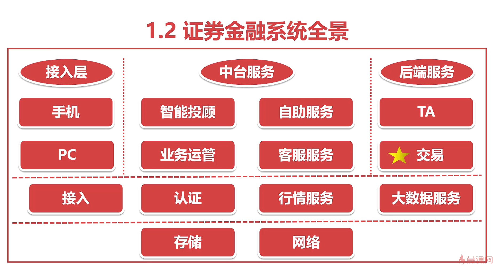
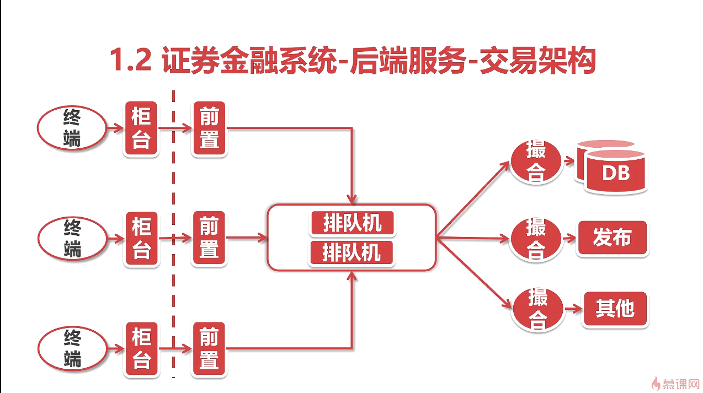
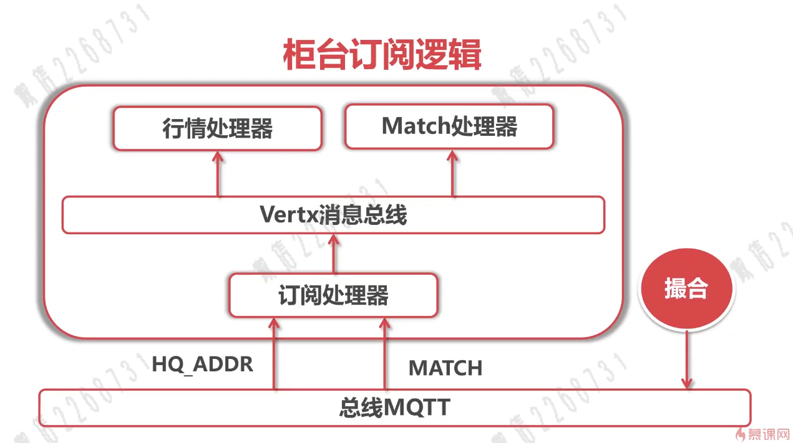

上面的图片就是钱(货币)的流动的理想图，除了货币，还有债券，拆借等等金融工具在流转

资本市场中，流通的是证券

帮助企业上市(也就是发行中介) 投行

委托中介(经纪业务，用户在投资机构 开通账户帮忙投资)
因为个人不能直接和交易所交易 ，必须委托给投资机构

交易主站1~n通过tcp https ws 连接终端(手机app PC端 Web DNS)

终端把数据推送给交易主站

日志会放在大数据平台

有一个专门的线程管理与终端的连接

有终端发数据的话，这个专门的线程把数据交给到专门的业务的线程

权限鉴权就是请求会带有token等身份信息,然后鉴别身份信息

流速是查看请求是否来得及处理

记日志

处理业务

返回响应

中台和业务是最紧密的
所以中台需要快速的响应和迭代
把中台业务拆成一个个微服务，原子化成各个基础组件
而业务就是各个基础组件的组合

半同步的意思是 主db必须接收到备db的ack之后再进行

TA=transaction agent

这里的核心就是交易系统

终端可以是 web app等等
柜台就是券商的服务窗口 柜台负责报送委托的模块叫做报盘机
报盘机把顾客的委托先丢给前置网关，排队机把前置网关的数据一批拿走
再按照时间优先，价格优先，量优先，进行排序
在撮合，再把行情数据发布出去

排队机特性:
高可用+低延迟

柜台保存顾客所有数据 主要是自己持仓 委托记录 成交记录
券商和商业银行清算中心和登记结算中心 清算股份，最后再和所有的顾客清算股份

eg：一个客户想买平安银行的股票，收到从终端的客户的委托之后，柜台需要判断这是深交所的还是上交所的上市的股票
如果是上交所，就选择 自己和上交所的交易网关的链路 并发送数据

报盘:保存客户的委托，并提供查询功能 ； 与交易所通信，把客户的委托交传递给交易所，接受交易所发送的报价

登录： 先委托终端 再柜台

银证转账：
07年之前

客户资金 从银行卡 -> 券商的账户（客户证券保证金专用账户） -> 银行账户
券商根据客户存入还是取出进行相应的操作
eg:
客户 转了100w => 客户证券保证金专用账户
保证金专用账户 也就是说 可以只要30w 就算符合内外部的监管要求 30w就是保证金
当时很多营业部 对剩余70w进行非法操作， 类似于那客户的钱炒股票
如果70w操作 导致丢失的话，客户想要取钱，就取不到了

现在是三方存款制度
人话就是现在的钱 不是存在券商 而是存在银行， 银行来清算钱
银行清算完之后，在高职给券商，券商只有账本，没有客户资金

发送委托：
一般情况下
委托终端会把委托 发送给柜台 ，柜台写到db的委托表
然后有一个进程以高频来轮训委托表 然后发送给报盘机
但是对磁盘的要求很高，造成计算资源的浪费

新的架构
不需要维护轮询的进程

根据img_40 和前端代码 OrderWidget，当，填入了价格这个数字之后 就会根据你的可用资金算出最大可买的股票数量
A股交易是每一股票 按照 守 来买1 1手 = 100股，美股就是按照 股 来买

根据img_41,在demo中实时委托成交和历史委托成交 是一个个功能

各家机构的报盘机 是需要连到 交易所的撮合系统
为了接入的高效，交易所会暴露指定的接口和格式
为了安全，交易所 会用各种各养的校验来过滤请求

根据img_43
和委托终端 与 柜台 之间的交互有所不同
柜台与网关 是通过tcp
前置网关对于柜台的数据是不做出业务答复，也就是数据是单向的，
为了交易撮合系统而言，把委托送到撮合核心是优先级最高的事情，其他事情都要给该业务让路
为了保证委托的公平和带宽的利用率，各家机构连接柜台和网关的线 是不会做其他事情的
值域数据的改变，委托的变动 下发的行情，交易所会用其他线路 通过总线的方式发送给各家机构
也就是上行和下行的结构
交易所的网关使用热备的方式来实现多活

排队机: 固定的频率从委托网关中收集委托订单 + 排序
网关不主动发送数据给排队机的原因
不同网关的机架和排队机集群的物理距离 是不同的
会存在某些网关比较早的接受柜台的委托，但是与排队机集群的物理距离导致比其他 离排队机集群近的网关 更晚发送委托

所以改成了排队机主动固定频率去拉取委托，然后对某些时间段的委托集中排序

定序的三大原则
时间优先
相同的时间 再价格优先 买入的价格越高优先 ，卖出的价格越低越优先
相同的价格 量优先

排队机 必须高可用,不能一个一个节点挂了，排队机集群就挂了
必须数据一致性，如果撮合核心重启之后，会随机往排队机集群的某一个节点拉取数据，必须保证所有节点的数据一致

对于img_55而言，a =2 b = 5 因为b=10 并没有被大多数节点接受

撮合核心
输入的是订单流 这个流是一个流的群 有的流输出的是行情 和有的流订单的信息
根据 img_58
排队机和撮合核心的链接是udp
udp的包头小，轻量 不需要三次链接
撮合模块是不固定的，每次变化都要在排队机模块修改tcp连接的相关配置
内往下，丢包率非常低

disruptor 本质是一个高性能的队列
每一个队列的元素被定义成event
队列的长度在初始化的时候被定义
有一个线程按照序号递增的形式网队列里面写入event 生产线程 生产线程有一个对应的cursor 是volatile标记的
生产线程塞入一个event之后，会更新cursor,因为volatile的写屏障 会导致 消费线程被通知到 那个cursor被生产线程塞入event
另一个线程在同时读取数据 消费线程 消费线程有一个对应的cursor 是volatile标记的
消费线程会用自己的cursor和生产线程的cursor作比较 只要 自己的cursor小于生产线程的cursor就消费

其实可以实现级联 或者递归吧 可以加在一个消费线程2，有一个cursor起跟踪 消费者1的cursor

所以 因为单线程写入 所以不要竞争这个队列的临界资源

当然写入的时候会使用cas乐观锁

第三个特点是Cache Padding
因为 cpu cache memory 有个存储等级
cache 又分为 L1 L2 L3
L1 类似一个二维数组 每一个行总共存64bytes 每一个单元格是8bytes
操作系统在处理连续的内存数据 会一口气存放连续的数据到cache
比如会一口气存放L1到的一行数据量 而不是存放到L1某一个单元格的数据量 ，减少和内存的交互速度

但是 如果有多个cpu ，多个线程需要用到同一个对象(数据) ，就对导致 这个对象(数据)会在多个缓存上存在
假设计算单元更新了数据的某一部分，为了让其他线程看到最新的数据，会让其他缓存的该数据所有部分失效

1.流转到 前置风控
2.订流转到 订单簿 完成撮合
3.订流转到 发布线程 根据撮合的结果进行航行的发布
按照系统的维度：有前置风控 盘中风控 盘后风控
按照风控类别的维度：价格类 持仓类 交易行为类......
这里只做 前置风控(交易实时)

各位目客网的小伙伴们,大家好,我是孤弟。
欢迎来到撮合交易系统的实战课。
这些课,我们接着回到主线任务,就是从总线拿到撮合核心发布的数据。
在再找总线上,撮合核心它是一个数据的发布者。
柜台呢?是这个数据的订阅者。
先来看一下柜台对于这部分数据它是如何处理的。
首先,每个柜台会在总线上订阅两个地址的数据。
第一个是5档行情的数据。
也就是这里的HQ_ADDR。
另外一个就是由自己发送出去的委托数据。
这个变化会通过另外一个地址返回回来,也就是这里的MATCH的数据。
根据上下有的约定,行情地址是-1,
然后撮合数据的变化的地址是这个柜台的ID号,
这些地址都是一个short的数据。
订阅处理器在收到这些消息之后,
会把消息沿着柜台内部的一个vertx的消息总线去分发。
这里使用vertx的消息总线,
主要是为了跟mqtt的总线做个区别,
其实不论使用哪个总线都是可以的。
但是我们知道,因为网络的划分,
柜台自己内部的这个消息总线,
以及柜台和交易所的网段通信的这个mqtt的总线,
它是不可能放在一个网站里面的。
所以我们就用两个总线来表示这两个逻辑,
表明他们之间是相互没有关联的。
在vertx这个消息总线上,
我们分别会挂一个行情的处理器,
跟一个match数据的处理器,
分别来处理不同的数据。
这节课主要任务呢,
就是完成这个订阅处理器的相关逻辑。
我们先打开久违的柜台的代码。

 我们知道Vertx它是能在同一个JVM之下
 建立一个消息总线的
 其实Vertx它的能力远远不止于此
 它还可以在WebSocket的协议之上建立一个消息总线
 中端跟柜台的交互呢?就用到了它的这个特性。
 柜台在收到撮合核心的数据之后,它会通过websocket的这个总线通知给特定的委托中端。
 委托中端在得知消息之后,会主动的触发一些函数。
 这里要注意的是,对于委托的变化还有成交的变化,柜台它只负责通知变化。
 具体的数据呢?委托中端它是会主动发起一个查询,自己去获取的。
 通过这种设计啊,我们是可以最大程度的来复用原来的接口,减少重复开发。
 但是行情数据呢?是在委托界面,我们输入了合法的股票代码之后,它会按照一个固定的频率通过这个总线跟柜台去要数据。
 我们再重复一遍啊,所以委托和成交数据,柜台它只给一个通知,
 然后委托中端会自己去柜台要,也就是说它是主动发起请求的。
 而对于行情数据,委托中端会以一个固定的频率,
 到柜台那边去请求。这其实是两种处理数据的逻辑了。
 了解了这些逻辑呢,我们就要开始完善对应的代码。
 这部分的代码是需要柜台和委托中端进行一个配合的。

