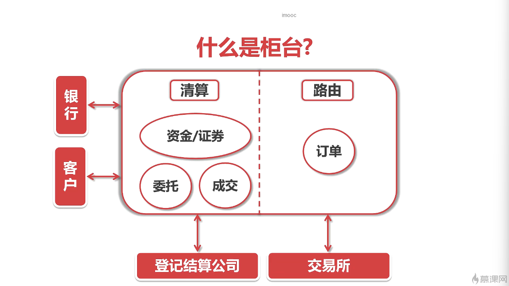

上面的图片就是钱(货币)的流动的理想图，除了货币，还有债券，拆借等等金融工具在流转

资本市场中，流通的是证券

帮助企业上市(也就是发行中介) 投行

委托中介(经纪业务，用户在投资机构 开通账户帮忙投资)
因为个人不能直接和交易所交易 ，必须委托给投资机构

交易主站1~n通过tcp https ws 连接终端(手机app PC端 Web DNS)

终端把数据推送给交易主站

日志会放在大数据平台

有一个专门的线程管理与终端的连接

有终端发数据的话，这个专门的线程把数据交给到专门的业务的线程

权限鉴权就是请求会带有token等身份信息,然后鉴别身份信息

流速是查看请求是否来得及处理

记日志

处理业务

返回响应

中台和业务是最紧密的
所以中台需要快速的响应和迭代
把中台业务拆成一个个微服务，原子化成各个基础组件
而业务就是各个基础组件的组合

半同步的意思是 主db必须接收到备db的ack之后再进行

TA=transaction agent

这里的核心就是交易系统

终端可以是 web app等等
柜台就是券商的服务窗口 柜台负责报送委托的模块叫做报盘机
报盘机把顾客的委托先丢给前置网关，排队机把前置网关的数据一批拿走
再按照时间优先，价格优先，量优先，进行排序
在撮合，再把行情数据发布出去

排队机特性:
高可用+低延迟

柜台保存顾客所有数据 主要是自己持仓 委托记录 成交记录
券商和商业银行清算中心和登记结算中心 清算股份，最后再和所有的顾客清算股份

eg：一个客户想买平安银行的股票，收到从终端的客户的委托之后，柜台需要判断这是深交所的还是上交所的上市的股票
如果是上交所，就选择 自己和上交所的交易网关的链路 并发送数据

报盘:保存客户的委托，并提供查询功能 ； 与交易所通信，把客户的委托交传递给交易所，接受交易所发送的报价

登录： 先委托终端 再柜台

银证转账：
07年之前

客户资金 从银行卡 -> 券商的账户（客户证券保证金专用账户） -> 银行账户
券商根据客户存入还是取出进行相应的操作
eg:
客户 转了100w => 客户证券保证金专用账户
保证金专用账户 也就是说 可以只要30w 就算符合内外部的监管要求 30w就是保证金
当时很多营业部 对剩余70w进行非法操作， 类似于那客户的钱炒股票
如果70w操作 导致丢失的话，客户想要取钱，就取不到了

现在是三方存款制度
人话就是现在的钱 不是存在券商 而是存在银行， 银行来清算钱
银行清算完之后，在高职给券商，券商只有账本，没有客户资金

发送委托：
一般情况下
委托终端会把委托 发送给柜台 ，柜台写到db的委托表
然后有一个进程以高频来轮训委托表 然后发送给报盘机
但是对磁盘的要求很高，造成计算资源的浪费

新的架构
不需要维护轮询的进程

根据img_40 和前端代码 OrderWidget，当，填入了价格这个数字之后 就会根据你的可用资金算出最大可买的股票数量
A股交易是每一股票 按照 守 来买1 1手 = 100股，美股就是按照 股 来买

根据img_41,在demo中实时委托成交和历史委托成交 是一个个功能

各家机构的报盘机 是需要连到 交易所的撮合系统
为了接入的高效，交易所会暴露指定的接口和格式
为了安全，交易所 会用各种各养的校验来过滤请求

根据img_43
和委托终端 与 柜台 之间的交互有所不同
柜台与网关 是通过tcp
前置网关对于柜台的数据是不做出业务答复，也就是数据是单向的，
为了交易撮合系统而言，把委托送到撮合核心是优先级最高的事情，其他事情都要给该业务让路
为了保证委托的公平和带宽的利用率，各家机构连接柜台和网关的线 是不会做其他事情的
值域数据的改变，委托的变动 下发的行情，交易所会用其他线路 通过总线的方式发送给各家机构
也就是上行和下行的结构
交易所的网关使用热备的方式来实现多活

排队机: 固定的频率从委托网关中收集委托订单 + 排序
网关不主动发送数据给排队机的原因
不同网关的机架和排队机集群的物理距离 是不同的
会存在某些网关比较早的接受柜台的委托，但是与排队机集群的物理距离导致比其他 离排队机集群近的网关 更晚发送委托

所以改成了排队机主动固定频率去拉取委托，然后对某些时间段的委托集中排序

定序的三大原则
时间优先
相同的时间 再价格优先 买入的价格越高优先 ，卖出的价格越低越优先
相同的价格 量优先

排队机 必须高可用,不能一个一个节点挂了，排队机集群就挂了
必须数据一致性，如果撮合核心重启之后，会随机往排队机集群的某一个节点拉取数据，必须保证所有节点的数据一致

对于img_55而言，a =2 b = 5 因为b=10 并没有被大多数节点接受

撮合核心
输入的是订单流 这个流是一个流的群 有的流输出的是行情 和有的流订单的信息
根据 img_58
排队机和撮合核心的链接是udp
udp的包头小，轻量 不需要三次链接
撮合模块是不固定的，每次变化都要在排队机模块修改tcp连接的相关配置
内往下，丢包率非常低

disruptor 本质是一个高性能的队列
每一个队列的元素被定义成event
队列的长度在初始化的时候被定义
有一个线程按照序号递增的形式网队列里面写入event 生产线程 生产线程有一个对应的cursor 是volatile标记的
生产线程塞入一个event之后，会更新cursor,因为volatile的写屏障 会导致 消费线程被通知到 那个cursor被生产线程塞入event
另一个线程在同时读取数据 消费线程 消费线程有一个对应的cursor 是volatile标记的
消费线程会用自己的cursor和生产线程的cursor作比较 只要 自己的cursor小于生产线程的cursor就消费

其实可以实现级联 或者递归吧 可以加在一个消费线程2，有一个cursor起跟踪 消费者1的cursor

所以 因为单线程写入 所以不要竞争这个队列的临界资源

当然写入的时候会使用cas乐观锁

第三个特点是Cache Padding
因为 cpu cache memory 有个存储等级
cache 又分为 L1 L2 L3
L1 类似一个二维数组 每一个行总共存64bytes 每一个单元格是8bytes
操作系统在处理连续的内存数据 会一口气存放连续的数据到cache
比如会一口气存放L1到的一行数据量 而不是存放到L1某一个单元格的数据量 ，减少和内存的交互速度

但是 如果有多个cpu ，多个线程需要用到同一个对象(数据) ，就对导致 这个对象(数据)会在多个缓存上存在
假设计算单元更新了数据的某一部分，为了让其他线程看到最新的数据，会让其他缓存的该数据所有部分失效

1.流转到 前置风控
2.订流转到 订单簿 完成撮合
3.订流转到 发布线程 根据撮合的结果进行航行的发布
按照系统的维度：有前置风控 盘中风控 盘后风控
按照风控类别的维度：价格类 持仓类 交易行为类......
这里只做 前置风控(交易实时)

各位目客网的小伙伴们,大家好,我是孤弟。
欢迎来到撮合交易系统的实战课。
这些课,我们接着回到主线任务,就是从总线拿到撮合核心发布的数据。
在再找总线上,撮合核心它是一个数据的发布者。
柜台呢?是这个数据的订阅者。
先来看一下柜台对于这部分数据它是如何处理的。
首先,每个柜台会在总线上订阅两个地址的数据。
第一个是5档行情的数据。
也就是这里的HQ_ADDR。
另外一个就是由自己发送出去的委托数据。
这个变化会通过另外一个地址返回回来,也就是这里的MATCH的数据。
根据上下有的约定,行情地址是-1,
然后撮合数据的变化的地址是这个柜台的ID号,
这些地址都是一个short的数据。
订阅处理器在收到这些消息之后,
会把消息沿着柜台内部的一个vertx的消息总线去分发。
这里使用vertx的消息总线,
主要是为了跟mqtt的总线做个区别,
其实不论使用哪个总线都是可以的。
但是我们知道,因为网络的划分,
柜台自己内部的这个消息总线,
以及柜台和交易所的网段通信的这个mqtt的总线,
它是不可能放在一个网站里面的。
所以我们就用两个总线来表示这两个逻辑,
表明他们之间是相互没有关联的。
在vertx这个消息总线上,
我们分别会挂一个行情的处理器,
跟一个match数据的处理器,
分别来处理不同的数据。
这节课主要任务呢,
就是完成这个订阅处理器的相关逻辑。
我们先打开久违的柜台的代码。

 我们知道Vertx它是能在同一个JVM之下
 建立一个消息总线的
 其实Vertx它的能力远远不止于此
 它还可以在WebSocket的协议之上建立一个消息总线
 中端跟柜台的交互呢?就用到了它的这个特性。
 柜台在收到撮合核心的数据之后,它会通过websocket的这个总线通知给特定的委托中端。
 委托中端在得知消息之后,会主动的触发一些函数。
 这里要注意的是,对于委托的变化还有成交的变化,柜台它只负责通知变化。
 具体的数据呢?委托中端它是会主动发起一个查询,自己去获取的。
 通过这种设计啊,我们是可以最大程度的来复用原来的接口,减少重复开发。
 但是行情数据呢?是在委托界面,我们输入了合法的股票代码之后,它会按照一个固定的频率通过这个总线跟柜台去要数据。
 我们再重复一遍啊,所以委托和成交数据,柜台它只给一个通知,
 然后委托中端会自己去柜台要,也就是说它是主动发起请求的。
 而对于行情数据,委托中端会以一个固定的频率,
 到柜台那边去请求。这其实是两种处理数据的逻辑了。
 了解了这些逻辑呢,我们就要开始完善对应的代码。
 这部分的代码是需要柜台和委托中端进行一个配合的。

我们的课程啊,是按照订单委托和反馈的这个顺序,
依次完成了委托中端、柜台、前置网关、排队机、
还有撮合核心这几个模块来开发的。
每个模块呢,都有很多设计,还有编码方面的一些考量。
我们按照这个订单的数据的流向啊,一个一个来看。
在委托中端和柜台的部分啊,

第一个就是代码的分层调用,在写这些代码的时候,
我们是不能眉毛胡子一把抓的,要根据一定的调用的顺序关系,
把相关的代码封装到一块,
比如跟网络打交道的代码, 还有业务处理的代码,它就不太适合放在一起。

第二个呢,就是数据库字段的一些注意事项。
作为委托还有成交,这样的基础数据库存储的一定是未经加工的数据。
如果一些字段它带有小数的,就需要全部转换成长整型。
比如价格,我们就是先乘以一万之后,再存到数据部的字段里面去的。
基础表里面啊,是不会存储一些像成本价这样的字段的。
这些计算之后的加工的数据必须是从原始数据表捞出来再算的。

第三个,在网关部分,我们发送TCP报文的时候,
我们更倾向于用一个任务队列来解耦 生成 和 实际发送 这两块逻辑的。
你如果每次收到包,都直接调用socket的网外发,一旦数据量涌上来了,
很有可能会影响整个服务。
用一个任务对列的方式,把发送逻辑剥离到一个单独的线程里面去做。
这个对于柜台的稳定可以说是非常有必要的。

在排队机这一部分,有三个注意点。
第一个,就是在跟网关通信的时候,为了公平起见,
我们的数据不是从网关主动发送给排队机的, 而是排队机采取一个定式抓取的策略。
第二个,就是在开发定序功能的时候,
我们对三级定序,每个定序逻辑都进行了一个拆分,
每个函数它只算一个排序逻辑，这样更方便以后我们升级一些小的逻辑。
最后一个,就是我们使用UDP的组播,而不是TCP的连接方式, 来给撮合核心喂数据。
因为使用了UDP,我们给这个UDP加了一个NACK的方式来确保包的顺序。
这种NACK,就是通过一个约定好的递增的Package Number来实现了。

在撮合核心部分,也有这样几个关注点。
第一个,就是订单簿的这样一个数据结构。
订单簿的数据结构,需要考虑能快速地定位某个订单, 同时还能快速地删除和新增订单。
第二个点,就是在排队机遇到位置情况崩溃的时候, 我们是如何处理的。
第三个点,就是在整个开发的过程当中, 我们大量的使用了Eclipse Collections里面的原始数据类型的集合。
这些集合都是GC友好的,比JDK自带的那个集合,性能要高出一截。
因为这些原始数据的包装类型,
在拆包跟解包的时候,会有很多额外的开销。
这些代码和设计方面的考虑,
它并不是凭空出现的。许多都是工作当中踩出来的坑。
我们在工作当中,经常会遇到领导拍板, 立马就要开干的局面。
一开始上项目的时候, 大家都是压着工期,图快,能用就行。
真正上线了之后,你才会发现这里面有好多的坑。
说这个呢,也是希望小伙伴们能认识到,
在IT工作当中是存在一个这样的情况的。
就是大部分时候,你的项目开展, 工期都是很紧张的，没有时间让你从容的做设计,慢慢打磨。
这个时候,就很考验你平时的积累了。
如果工作至于你有余力, 多关注别人的代码,多学习多积累,
养成一个比较良好的开发习惯, 就能在上项目的时候,避开很多坑。
特别的希望,大家能多思考,多纵结。 把课程当中的精华内容, 内化成自己的知识, 从而指导自己的开发工作。
如果说,只是通过某个课程, 学会了某个新的技术, 或用了几个新的API,
那么这十几个小时, 很漫长的宝贵的时间,就太不值得了。
接着说说,我在金融机构当中, 做中后台开发的一些新的体会吧。
其实在写这张的文案的时候, 我本来是列了很多的新的体会的,
但是发现放在课程里面, 都有一些脱离主题了,
所以经过再三的删解和考虑, 我这里只提一个我认为最重要的关键词, 就是要重视流程的规范性,
具备一个兜底思维。 
温馨提示,接下来的内容我没有做PPT, 大家可以闭眼使用。
因为金融机构它的许多IT系统, 都涉及到资金,还有票据的一些流转。
对于这些系统来说, 稳定跟业务逻辑的正确性是压倒一切的。
我工作过的几家机构呢?
他们在升级模块之前, 都会经过多轮的测试, 尤其是一些核心模块,
测试完成之后, 还有测试中心跟开发部门的领导签字。
上线之前,都会出一份应急方案。
这个方案里面,
就要交代, 如果升级失败了,
你要怎么回退? 
要是不能回退, 可以有哪些应急处置?
所有的这一切, 都会形成一个详细的流程文件,
交到最后的运为保障的手里面。
一开始, 我会觉得这些流程,
真的很没有必要。
不就是写代码吗?
整这些没用的流程干什么呢?
直到有一回, 遇到的一个封控系统的现场事故,
彻底的改变了我的看法。
当时情况是这个样子的,
我们的封控系统, 会接外部的一些行情数据,
然后对这些数据, 会做一些指标的计算,
从而对当天的交易, 会进行一些限制跟封控。
当时系统上有的行情数据,
发生了异常,
因为它推过来的数据, 某些字段给了空,
而在代码的计算里面, 又恰好一带了某个字段,
这就导致了多台服务器, 不停的在抛异常,
每台服务器一分钟, 会打三个G的异常日志。
最麻烦的还不是这个打日制,
最要命的是封控系统出了问题,
它会导致好多申报, 过不了这个封控。
那过不了封控, 这笔声报它就发不出去啊。
特别庆幸的是, 用为的同事在上线之前,
非要我们出个planB给它。
所以我们在开发的时候,
给封控系统, 加了一些指标计算的可插拔了一个特性。
最后的处置方案, 就是临时把那个指标给关闭了。
前前后后一共五分钟,
这才把这个损失 控制在了可接受的范围之内。
从那以后, 我就对这个编码的非空判断还有应急处置方案都非常的上心。
大家也可以看到啊,
在前面代码的编写过程当中,
有很多地方明明不需要空判断的, 我也都把空判断给加上了。
讲这个事情啊,
就是希望大家在编码的过程当中,
要多考虑考虑编界的情况,
同时对你自己工作的单位,设置的各种OA流程,多一些理解,多一些包容,
不要觉得这些流程笼长、累坠没有效率啊。
说不定啊, 
正是某些看似没有效率的流程, 能挽救你的职业生涯, 挽救你的年终奖。
最后再说说炒股这件事情吧,
其实从业之后,
A股账户就已经消掉了,
因为从业人员呢, 他是不可以有A股账户的,
我呢也只有一个基金账户, 长期买一些自己公司出品的
红利指数基金,
已被退休之后能有第二份的收入啊。
对于炒股这件事情呢,
大家可以经常问问自己一个问题,
就是说你能不能依靠自己的
专业技能实现财务自由,
这个专业技能啊,
不是说炒股啊,
是指你的大学专业,
或者说通过其他的途径,
专门培训之后,
习得的一种技能,
你说如果通过你的专业,
都没有办法实现财务自由,
那么再聚集了各行各业,
那么多聪明人的股市,
你凭什么能够超越市场,
来战胜绝大部分人,
所以啊,
跟股票投资比起来,
在自己的专业领域,
好好耕运,
积累知识和智慧,
你说是不是成功的概率会更高一些呢?
到这里啊,
我们的课程就全部结束了,
最后呢,
要再次感谢大伙的支持,
感谢家人的理解,
我是gudy,
咱们后会有期啦!

我们会围绕两件事情来展开。
第一个,就从业务角度认识一下,什么是柜台。
第二件事情,就是要把柜台的脚手架代码搭建起来。
给下个章节的柜台开发,打好基础,开发一个柜台。
首先要知道这个柜台是干嘛用的。
它要开展哪些业务功能。
柜台的交易系统有两个核心功能。
这里我用红色的实现框了出来。
第一个是清算。
柜台里面会保存客户所有的数据。 我把最重要的三项列在这里, 它们分别是资金持仓、委托记录和成交记录。
不要小看这些数据哦，这些数据是清算的核心。
券商会根据这些数据和商业银行清算资金 和登记结账公司清算股份， 最后再和所有的客户清算资金以及股份。
具体的清算业务是个十分庞大的内容, 需要开专门的课程去讲。
这里不做展开。
我们的课程当中涉及到清算的部分, 只是其中的客户数据的持久化。
柜台的另一个重要的功能是交易订单的路由。
举个例子,一个客户想买平安银行的股票,
在收到客户从中端发过来的委托之后, 柜台需要判断这个是深交所上市的股票, 还是上交所上市的股票。
判断之后,他发现这个是深交所的股票, 然后他就会通过自己和深交所交易网关的链路, 把这笔委托发送过去。
这个选择路由,然后发送的过程就叫做订单路由。
通过以上的介绍,大家应该可以清楚的知道,
柜台在整个交易撮合系统当中扮演一个什么样的角色了。

这里章节的主要内容是做交易所网关开发之前的准备工作。
整个会分成两大块来进行。
第一块是介绍一下前置网关的基本的知识。
就是什么是前置网关。 另一块我们会完成一个小的编码工作。
这个作业有两部分构成。
一个是TCP接入的服务端，另外一个就是连接到这个服务端的一个客户端。
网关的英文名字叫Gateway,它其实是一个中间设备，主要是用来提供一些内部和外部的隔离的作用。
除了隔离,它还可以做身份认证、协议转换等等的功能。
我们对着这个图来说明一下,
各家金融机构他们的报盘机是需要连到交易所的撮合核心去进行交易错核的。
为了接入的高效,交易所是有必要对外发布一个统一的数据格式的接入的。
于是同时,出于安全的考虑,交易所收到的所有的数据都会用各种各样的教验来过滤。
就是要把一些非法的请求或者数据错误的请求进行过滤。
我们可以看到,这个虚线代表了就是这两个章节要完成的网关的功能。
虚线在机构的报盘和交易所的错核核心之间,架起了一个安全的防火墙。
和前面委托终端跟柜台的交互方式有所不同。
柜台向交易所的网关、传递数据是通过TCP协议来传输的。
而且,前置网关对于柜台的数据是不作出业务答复的，
也就是说,柜台的数据里的话,流向网关都是单向的，数据只会从柜台到网关。
大家知道这样设计的原因吗? 这种单向的数据流的结构是有特殊的考量的。
因为对于交易撮核系统而言,把委托送到撮核核心是优先级最高的事情。
其他的数据都需要给这个业务让路,为了保证委托的公平,并且把这个带宽的资源利用到极限。
各家机构连接柜台和网关的这条线路是不会做其他事情的。
它只管发送委托,至于数据的反馈,包括委托的变动和下发的行情。
交易所会从另外一条线路往各家机构通过总线的方式来下发数据。
对于委托这项业务而言,数据的上行下行这两条线路是一定不能放在一块的,必须要是隔离的。
说完它的数据流的拓扑图,另外还有一点要说明的就是,交易所的网关,它都是用热备的方式来做了多活。

最张洁的主要内容,是对排队机的业务,还有实现的技术做一个介绍。
张洁的内容主要分成这样三个部分。
第一块,我们是来介绍排队机的业务知识。
第二个部分,就要说一说排队机的技术框架的选型。
第三块,我们会依赖于现有的框架,来完成一个分布式的key-value的数据库,这样一个demo。
这个完成的demo是下一个章节,我们真正在开发排队机功能的时候作为一个基础代码的作用。
那我们先来看看排队机它是做什么用的。
排队机它做的工作主要有两个,我们已经用小圆框在这标了出来。
第一个,它是按照固定的频率,从各个委托网关来收集订单。
另外一个,就是对所有收集过来的这些订单进行一个排序。
可能有人会对这个设计方案有疑问,说为什么不是网关主动地把这个订单发送到排队机里面去,
而是等着排队机到每一个网关去拉数据呢?这样是不是效率会很差呢?
这样设计是有它的特殊的业务场景来考虑的, 因为如果从网关主动地把数据发到排队机去,会存在一个公平性的问题。
大家都知道,从委托网关,它所在的这个机架到排队机的集群所在的这个机架, 它是没有办法保持在物理距离上的严格的相等的,也就是说会存在一种情况。
某些网关接收到了柜台的订单时间比较早, 但是因为这个委托网关距离排队机的物理距离比较远, 它的订单反而会比其他更近的网关延迟到达排队机的集群。
在这种情况之下,对于连接到那个较远的网关的机器来说, 那个柜台它发送的委托是要吃亏的,这样是不公平的。
为了杜绝这种情况,排队机就设计成去每一个网关, 按照一个固定的频率,是拉取消息这种方式来进行工作。
在排队机收集了所有这些网关在消息之后, 对当前时间区间内的所有的委托进行一次集中的排序, 这样对于所有的这些终端,
他们的委托是会进行一个公平的排序的, 不会存在后发先至的这种情况。
这个也就是为什么排队机会主动去委托网关拉取数据, 而不是网关把这个数据发送到排队机的原因。
介绍完这个拉取数据的逻辑, 我们再来看看排队机的另一个重要的业务知识,
那就是定序，定序的逻辑有三层的规则。
第一个是时间优先。时间优先它比较好理解啊,
就是先下单的,它一定是排在前面的。
比如说,我和另外一个人买平安银行的股票,
我是在10:00:00进行的委托, 而另外一个人在10:00:00进行的申报, 那我申报的单子是一定会排在你的前面的。
第二条规则是价格优先。
价格优先它什么时候发挥作用呢?
如果两笔申报的时间是同时的,
比如说我们俩申报的时间戳都是10:00:00,
这个时候啊,价格有优势的就排在前面了。
什么叫价格优势呢?
举个例子啊,
就是我申报22块买平安银行, 然后你申报21块来买它,
那我的委托申报是一定会排在你前面的。
同理啊,如果大家都是做的卖委托的申报,
那么卖出价格更低的,它的优先级就更高，也就是说会排在委托对列的前面。
第三层,就是量优先。
如果我们俩申报时间也一样, 委托的价格也一样,
那么这个时候啊,就看谁的委托量大, 谁就排在前面。
不难看出, 所有的这些规则它的设计都是遵循了一个原则: 那就是让尽量多的申报啊,能够撮合成交。
就是要使整个市场的成交量达到最大,
因为排队机的这种主动拉取数据的设计方式,
它在性能方面的要求,其实并不是那么高。
对于排队机的要求呢,主要是集中在以下两点上。
第一个,首先这个排队机的服务,它是不能down掉的,
这个其实就是一个高可用的要求。 不能说因为某一个排队机节点它坏了,
就导致整个排队机失效了,这种情况我是不能接受的。
第二个,就是所有的这些节点,它保存的数据是要一模一样的,
因为排在它后面的撮合核心如果挂掉了, 它是要从排队机里面去重新拉取数据的,
然后它从哪一个节点里面拉就是不确定的, 这就要求所有的这些排队机节点里面的数据要保持高度的一致性。
总结起来,这个里面就会涉及到高可用的知识, 还有一致性的知识。

撮合核心的业务可以用一个流程图来说明,它类似于一个管道。
管道的输入内容就是订单流,输出的就是行情还有其他撮合的产生的结果。
要说明的是,并不是每个撮合核心都是向外发送全部类型的数据的。
每个撮合核心它都会有一个开关来控制要发送的数据的类型。
真正的交易撮合系统会有很多的撮合核心同时在工作。
有的撮完后它只会发行情,有的它只发委托的订单变化。
这么做的底层逻辑是说,只要进入撮合的数据流,也就是这个订单的流,流序是一致的。
撮合出来的结果必定是一致的,毕竟它们代码都是一样。
还有一点要强调的是,为了充分的发挥性能,所有的撮合核心彼此之间是没有交互的。
它们都是独立运行的。
那可能有人就会问了,那这个撮合核心万一挂掉了怎么办呢?
作为核心的模块,它肯定是绕不开这个话题的。
我这里可以先剧透一下,撮合核心它只要挂掉了,
重启之后它会重新从排队机再拉一遍数据,把整个撮合的流程再走一遍。
因为撮合的速度是非常快的。
这一块在柜台的层面你是感知不到的。
在工作当中,我们就是用这种方法来保证撮合的可用性的。
就是它挂掉,那就让它挂掉好了,然后我们迅速的重启起来。
在这个部分,你只要监控做好了,基本上就没有问题了。
所以对于撮合核心来说,它是不存在高可用的问题的。
根据刚才的业务内容的介绍,我们可以总结出来,撮合核心要开发的功能点了。
第一个,就是从排队机接收委托,然后对这个数据进行一个校验。
如果发现丢包了,是要主动跟排队机去要丢掉的数据的。
第二个,就是对委托订单进行一个撮合。
它当然就是撮合核心的最重要的功能了。
第三个,就是对外发布数据流。
这些数据流会包含委托,还有行情等等等等。

整个服务的重中之重,就是对撮合这一块逻辑的处理。
本质上,就是对订单簿的处理。
订单簿的英文叫做OrderBook。
在介绍完撮合核心的业务之后,我们要把这些功能点一个一个的过一遍。
在写单码之前,就做到心中有数。
首先,是排队机跟撮合核心交互的这个设计。
这一块最重要的一个点,是交互的底层通信协议。
和大家想的不一样,在实际工作当中,排队机跟撮合核心的交互呢,
我们选择的是使用UDP的广播,而不是使用TCP的连接。
那为什么用UDP呢?有这样几个原因。
第1个,大家都知道啊,UDP的协议包头它只有8个字节。
跟TCP比起来,包头小了十几个字节。
而且它不需要像TCP一样做三个握手,
更不需要说发送心跳来保持连接。
所以在网络开销这一块,UDP的开销是非常小的,基本上可以忽略不济。
第2个,是它比较灵活。灵活怎么讲呢?
就是你撮合模块的数量啊,不固定的。
比如说,有时候行情中心会集成一个撮合模块,清算服务会集成一个撮合模块。
要是每上一个新的服务啊,都去排队机里面重新配置一下,
让TCP去连接,这个清算部门它是肯定不会同意的。
所以采用UDP的广播,就避免了,频繁的去改动排队机的配置。
这一点就是它灵活的体现。
第3个,就是UDP的不可靠的问题。
有人会说,UDP它是不可靠的,容易丢包。
对于这个问题,没有实验,它就没有发言权了。
我们以前就用UDP丢包的问题做过专门的测试。
我们的测试场景是这样的。
在跳转三个交换机的情况下,用多个进程,不仅能发送1K字节的小包。
那为啥选1K呢?
因为这个包啊,比较接近排队机广播的那个包的大小。
我们连着发了7成24小时,中间一个包都没有丢过。
当时机器的情况是这样的。
发包跟收包的机器,CPU基本上都是在85%。
然后网络带宽都是打满了的。
可以这么讲啊,在内网环境当中,UDP的丢包率非常非常的低,可以忽略不计的。
这个也是我们采用UDP的原因。
那万一丢包了怎么办呢?
我们还有后续的补足措施,就是在挫折模块它收包的时候啊,
会核对排队机的给着这个包的序号。 要是包的序号不是顺序递增的,那么就会主动发起请求。
撮合核心就会主动发起请求,跟排队机去要,去要那个丢掉的包。
第二个功能点呢,就是这个orderbook(对应五档行情)。
在这个里面要关注的就是如何定义一个数据结构,来存储所有的委托。
这里面呢,我们会有两个数据结构。
第一个,是整个大的orderbook，我们会用一个map来存。
这个map的key,就是图中的这个红色的,就是价格。
value,就是每一行的这个订单。
然后第二个数据结构呢,就是每一行的这个订单, 我们也会把它定义成一个对象。
每一行可以认为是一个链表,用来存储委托的明细。
这个结构,在我们写代码的时候,会更具体的展开来讲。
第三个功能点,就是行情和委托变动的发布。
发送这块,我们采用的方式, 是把数据丢到一个mqtt协议的总线上, 让有需求的服务自己去订阅。

