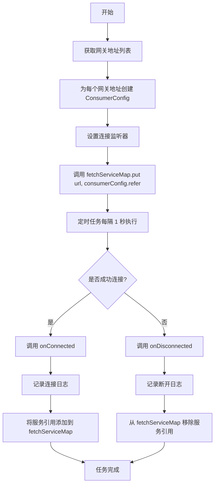

```mermaid
flowchart TD
    A[开始] --> B[获取网关地址列表]
    B --> C[为每个网关地址创建 ConsumerConfig]
    C --> D[设置连接监听器]
    D --> E[调用 fetchServiceMap.put url, consumerConfig.refer]
    E --> F[定时任务每隔 1 秒执行]
    
    F --> G{是否成功连接?}
    G -->|是| H[调用 onConnected]
    G -->|否| I[调用 onDisconnected]

    H --> J[记录连接日志]
    J --> K[将服务引用添加到 fetchServiceMap]
    I --> L[记录断开日志]
    L --> M[从 fetchServiceMap 移除服务引用]

    K --> N[任务完成]
    M --> N

```
